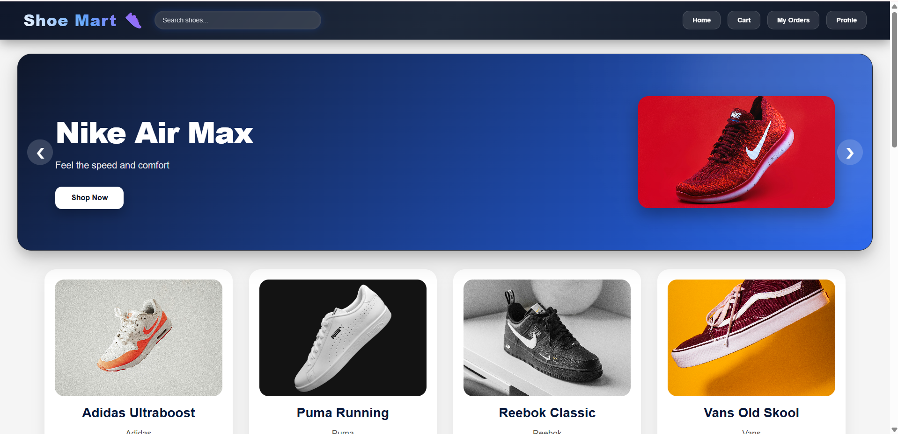
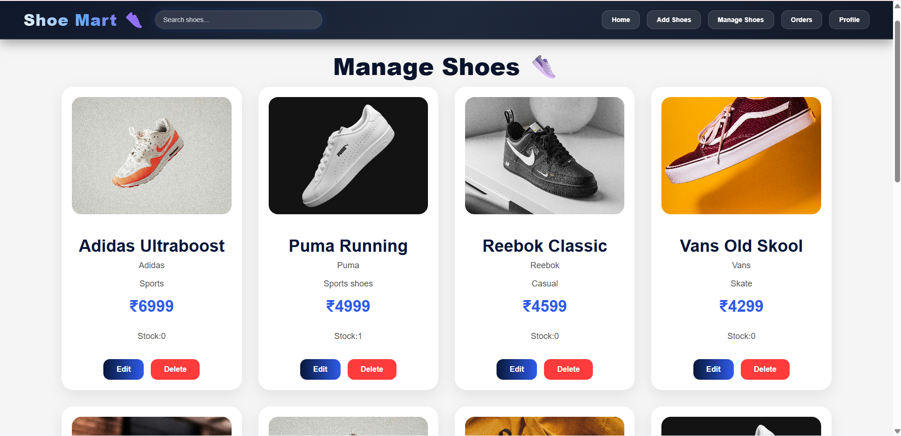
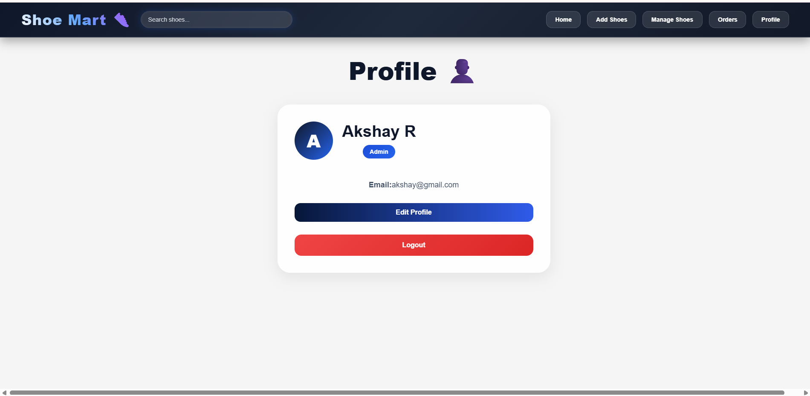
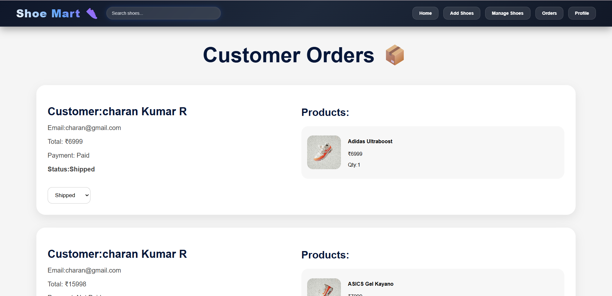

<div align="center">

# 👟 Shoe Mart

### Modern Full Stack Shoe Shopping Web Application


<br/>
<br/>

🚀 A professional modern eCommerce shoe shopping platform with Admin & Customer functionalities.

</div>

---

# 📌 Overview

Shoe Mart is a full-stack MERN eCommerce application designed with a modern UI and responsive experience.

The application allows customers to browse shoes, place orders, manage carts, and track order status while admins can manage products and customer orders through a professional dashboard.

---

# ✨ Features

# 👤 Customer Features

✅ User Authentication  
✅ Browse Shoes  
✅ Search Shoes  
✅ Add To Cart  
✅ Quantity Management  
✅ Place Orders  
✅ My Orders Section  
✅ Profile Management  
✅ Responsive UI  
✅ Modern Product Cards  
✅ Animated Buttons & Effects

---

# 🛠️ Admin Features

✅ Add Shoes  
✅ Edit Shoes  
✅ Delete Shoes  
✅ Manage Shoe Stock  
✅ Manage Customer Orders  
✅ Update Order Status  
✅ Professional Dashboard  
✅ Animated Popup Forms  
✅ Real-Time UI Updates

---

# 🖼️ Modern UI Highlights

✨ Fully Responsive Layout  
✨ Professional Product Cards  
✨ Smooth Hover Animations  
✨ Gradient Buttons  
✨ Modern Admin Panels  
✨ Animated Popup Modals  
✨ Blur Background Effects  
✨ Clean eCommerce Design

---

# 🧰 Tech Stack

| Frontend | Backend | Database | Authentication |
|----------|----------|-----------|----------------|
| React.js | Node.js | MongoDB | JWT |
| CSS3 | Express.js | Mongoose | Protected Routes |
| Axios | REST API | Mongo Atlas | Role Based Access |

---

# 📂 Project Structure

```bash
SHOE MART/
│
├── client/
│   ├── public/
│   ├── src/
│   │   ├── components/
│   │   ├── pages/
│   │   ├── App.js
│   │   └── index.js
│
├── server/
│   ├── config/
│   ├── controllers/
│   ├── middleware/
│   ├── models/
│   ├── routes/
│   └── server.js
│
├── README.md
```

---

# ⚙️ Installation

# 1️⃣ Clone Repository

```bash
git clone https://github.com/your-username/shoe-mart.git
```

---

# 2️⃣ Install Frontend Dependencies

```bash
cd client
npm install
```

---

# 3️⃣ Install Backend Dependencies

```bash
cd server
npm install
```

---

# ▶️ Run Application

# Start Backend

```bash
cd server
npm start
```

# Start Frontend

```bash
cd client
npm start
```

---

# 🌐 Environment Variables

Create `.env` file inside `server` folder:

```env
MONGO_URI=your_mongodb_connection
JWT_SECRET=your_secret_key
PORT=5000
```

---

# 🔐 Authentication System

✅ JWT Authentication  
✅ Admin & Customer Roles  
✅ Protected Routes  
✅ Secure API Access

---

# 📱 Responsive Design

The application is fully responsive for:

- 💻 Desktop
- 📱 Mobile
- 📲 Tablet

---

# 📸 Application Screenshots

## 🏠 Home Page



---

## 🛠️ Admin Shes Management 



---

## 👤 Profile Page



---

## 📦 Admin Orders Management



---

# 🚀 Future Improvements

- 💳 Payment Gateway Integration
- ❤️ Wishlist System
- ⭐ Product Reviews
- 🌙 Dark Mode
- 🔔 Notifications
- 📦 Live Order Tracking
- ☁️ Cloud Image Uploads

---

# 👨‍💻 Developed By

<div align="center">

## Akshay R

Full Stack Developer 🚀

</div>

---

<div align="center">

### ⭐ If you like this project, give it a star on GitHub ⭐

</div>